# StackPulse

Interface de pedidos e widget pequeno para o terminal, escritos em **Rust**, com histórico de conversas em JSONL e métricas locais em SQLite. Escolha uma equipe e envie pedidos em uma tela de chat. Executa com **Codex CLI, Claude Code, Cursor Agent e Grok CLI**, reutilizando o login existente de cada client. Registra tokens, tempo, configuração e feedback. Para Codex, também importa os logs locais e soma orquestrador + subagentes observados.

Também oferece **imagem → perfil Markdown → execução → feedback → tendência diária**. Veja o [guia de equipes por imagem](docs/image-workflows.md) para configurar o auxiliar, usar a imagem de exemplo e executar pedidos no projeto.

```text
╭──────────────────────────────────────────────────────────────────╮
│ STACKPULSE                                           DIA · todos │
│ TOKENS 252.0k                      210.0k entrada · 42.0k saída  │
│ Cache 60%                                      Raciocínio 12.0k  │
│ CUSTO ?                                      sem tarifa (0/21)   │
│ TEMPO 2m00s ativo                                22m00s agentes  │
│ ··▂▃▁···▅█▂·············                                252.0k   │
│ Consumo sem base anterior                                        │
│ 21 agentes · 1 exec. · histórico local                           │
│ h:hora  [d]ia  m:mês  g:entrega  q:sair                          │
╰──────────────────────────────────────────────────────────────────╯
```

Ilustração com números fictícios. O programa começa com dados reais ou um estado vazio; não insere demonstrações no seu histórico.

## Comparar perfis

Execute `stackpulse compare`, marque ao menos dois perfis com `Espaço` e confirme com `Enter`. Depois, escreva o pedido comum e, opcionalmente, o comando de teste que valida a entrega. Antes de executar, autorize a escrita na pasta temporária; Enter ou uma resposta negativa cancela a comparação. Com menos de dois perfis disponíveis, o comando orienta a criar novos perfis usando `stackpulse profiles add`.

```sh
stackpulse compare

# Uso sem interação, com autorização explícita para escrever na pasta temporária
stackpulse --allow-workspace "$PWD" compare \
  --profile cost_efficient_gpt --profile quality_gpt \
  --prompt "Implemente a funcionalidade descrita em TASK.md" \
  --test "cargo test" --timeout 1800 --allow-tmp
```

Cada perfil recebe o mesmo pedido em uma execução nova, em paralelo, com sua própria cópia da pasta atual. A cópia exclui `.git`, `.stackpulse` e `target`; links simbólicos que apontem para fora da pasta são recusados. Os arquivos ficam na pasta temporária do sistema, em `stackpulse-{data-hora}-compare/`, com subpastas separadas por perfil e um `report.json` com validação da entrega, duração e tokens observados. A pasta é preservada ao terminar, e o comando mostra seu caminho absoluto e o de cada entrega. O sistema operacional ainda pode limpar arquivos temporários; copie as entregas que quiser guardar. O projeto mantém `.stackpulse/comparisons/latest.json` para consultar o vencedor. O comando de teste é executado após cada entrega; escolha um teste que cubra os critérios do pedido.

Sem teste, a entrega fica **inconclusiva** e não há vencedor. O sucesso do CLI por si só não comprova entrega. Entre as entregas aprovadas com métricas suficientes, a comparação considera tempo e consumo de tokens. O vencedor da última comparação recebe **🏆 ao lado do nome** na seleção inicial do StackPulse. O relatório é uma medição daquela tarefa, não uma classificação geral do perfil.

## Instalar

Na pasta deste projeto, execute:

```sh
./setup.sh

# Entre na pasta em que deseja executar os pedidos
cd /caminho/do/seu/projeto
stackpulse
```

O instalador compila a versão de produção e instala o comando em `~/.local/bin/stackpulse`, sem `sudo`. Se necessário, prepara o PATH no arquivo de inicialização do bash/zsh. Para usar na mesma sessão, execute o `export PATH=...` mostrado ao final; novos terminais carregam a configuração. Depois, rode `stackpulse` na pasta do projeto em que deseja trabalhar.

Após o build, **uma única página** reúne os plugins: **Instalar AI-Memory** marcado e, somente em uma plataforma compatível, **Instalar AI-UsageBar** desmarcado. ↑/↓ ou `Tab` escolhe o plugin; `Espaço` marca ou desmarca e `Enter` confirma todas as escolhas. Os detalhes e créditos acompanham o plugin em foco. Depois da confirmação, cada pacote selecionado tem seu acompanhamento de instalação. A seleção e o progresso requerem 56×20.

`--with-memory` e `--without-memory` fixam a escolha da memória; `--with-usagebar` e `--without-usagebar` fixam a escolha do monitor de consumo. Uma opção definida por flag continua visível, sem permitir alteração, quando existe outra opção editável. Se ambas as escolhas forem explícitas, a seleção é pulada. As preferências são independentes; não combine flags opostas do mesmo plugin. `Esc` dispensa apenas as opções editáveis, preservando as escolhas fixas. `Ctrl+C` interrompe a seleção antes de instalar qualquer plugin; o StackPulse já instalado permanece disponível.

Sem terminal interativo, o padrão instala AI-Memory e dispensa AI-UsageBar, respeitando as flags. Com `TERM=dumb` em um terminal interativo, a seleção mostra uma lista conjunta em texto: digite o número para alternar uma opção editável, `Enter` para confirmar ou `q` para dispensar as editáveis. Desmarcar preserva instalações existentes. Em scripts, prefira flags explícitas.

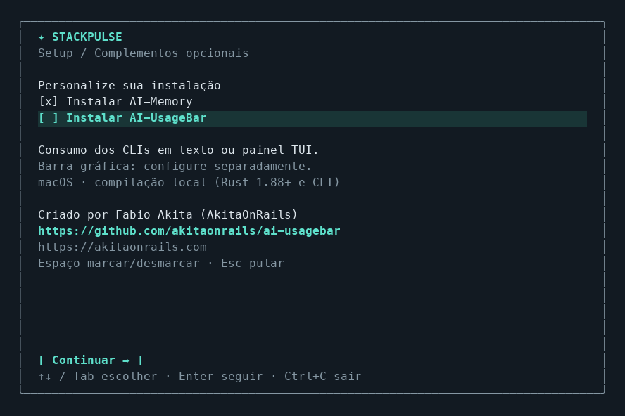

A tela de conclusão destaca a versão instalada, o caminho do executável e os próximos passos. O status do PATH distingue **disponível neste terminal**, **preparado para novos terminais** e **ativação manual**. Os comandos podem ser copiados diretamente. Terminais estreitos usam uma disposição compacta; `NO_COLOR`, `TERM=dumb` e saída redirecionada mantêm texto sem cores.

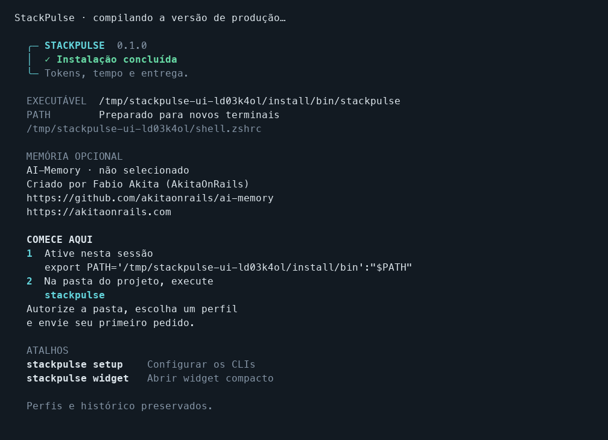

É necessário ter Cargo/Rust instalado. O build usa a versão fixada em `rust-toolchain.toml`. O script não instala Rust automaticamente, não chama providers e preserva os perfis, a configuração e o histórico existentes. Esses dados continuam nos caminhos `ai-token-timeline` para manter compatibilidade.

Use `/update` no chat ou `stackpulse update` no terminal para atualizar a instalação a partir dos fontes locais. O comando encontra a pasta de origem, recompila e preserva o diretório de instalação, o PATH, os plugins, os perfis e o histórico. Uma falha no build mantém o binário anterior. Depois, feche e reabra o StackPulse para usar a nova versão. O comando não baixa alterações do Git; atualize os fontes antes, se necessário. Se a pasta de origem mudou, use `stackpulse update --source /caminho/do/clone`.

```sh
# Instalar em outro local sem alterar o shell
./setup.sh --prefix "$HOME/apps/stackpulse" --no-path

# Escolher o arquivo de inicialização bash/zsh
./setup.sh --shell-rc "$HOME/.zshrc"

# Fixar AI-Memory e escolher o monitor na página de plugins
./setup.sh --with-memory

# Incluir AI-UsageBar e dispensar a memória, sem abrir a seleção
./setup.sh --with-usagebar --without-memory

# Instalar somente o StackPulse
./setup.sh --without-memory --without-usagebar

# Consultar opções, inclusive substituição explícita com --force
./setup.sh --help
```

O script localiza os fontes a partir de sua própria pasta e pode ser chamado de outro diretório. Mantenha-o junto de `Cargo.toml`. O pacote Rust conserva o nome interno `ai-token-timeline`; o executável instalado e os comandos mostrados na interface usam `stackpulse`.

## Memória e créditos

A memória opcional é o **[AI-Memory](https://github.com/akitaonrails/ai-memory)**, projeto criado por **[Fabio Akita (AkitaOnRails)](https://akitaonrails.com)**. O comando `/credits` no chat mostra o nome da memória, seu criador, os links e o estado da integração.

A instalação baixa o pacote oficial **v2.2.1**, verifica o SHA256 fixado no StackPulse e preserva o pacote completo, incluindo licença e hooks. São suportados macOS e Linux com glibc, em aarch64 e x86_64, com `curl` e `tar` disponíveis. O pacote fica em `PREFIX/share/stackpulse/ai-memory/v2.2.1`, com um link em `PREFIX/bin/ai-memory`; `PREFIX` é `~/.local` por padrão ou o valor de `--prefix`. Um AI-Memory já disponível no destino ou no PATH é reutilizado, sem atualização nem remoção.

**Pacote instalado não significa memória ativa.** O StackPulse ainda não configura a conexão MCP, os hooks dos CLIs nem um serviço de memória. Essa conexão é a etapa pendente da integração.

Para instalar depois ou repetir uma tentativa que falhou, execute na pasta do projeto:

```sh
stackpulse memory install

# Escolher outro local e mostrar a seleção antes de instalar
stackpulse memory install --prefix "$HOME/apps/stackpulse" --select

# Salvar a preferência no setup e instalar
stackpulse setup --ai-memory true

# Desmarcar a preferência, preservando instalações existentes
stackpulse setup --ai-memory false
```

Esses comandos pedem a mesma autorização de acesso à pasta que os demais comandos. Em scripts, use `--allow-workspace "$PWD"`. Em um terminal interativo, `memory install` mostra o progresso e o resultado da instalação, com **Tentar novamente** se houver falha. Se a instalação opcional falhar durante `./setup.sh` e você concluir sem resolver a falha, o StackPulse instalado é preservado e o script termina com código de erro.

## AI-UsageBar opcional

O **[AI-UsageBar](https://github.com/akitaonrails/ai-usagebar)**, criado por **[Fabio Akita (AkitaOnRails)](https://akitaonrails.com)**, oferece um CLI e uma interface de terminal para consultar o consumo dos planos. Ele aparece na etapa **Opcionais** do setup somente quando a instalação é compatível com o sistema detectado e começa **desmarcado**. O nome do projeto, o criador e os links aparecem junto da opção. A preferência `ai_usagebar` em `Settings` tem padrão `false`, inclusive ao ler configurações antigas sem esse campo.

O projeto também possui integrações para macOS e Windows; ele não é exclusivo do Linux. A instalação automática pelo StackPulse cobre:

| Plataforma | Instalação |
| --- | --- |
| Linux x86_64 com glibc 2.34 ou posterior | Binários oficiais de CLI e TUI |
| Linux aarch64 com glibc 2.18 ou posterior | Binários oficiais de CLI e TUI |
| macOS Intel ou Apple Silicon | Compilação local com Rust 1.88+, Cargo e Command Line Tools |

Linux com musl, arquiteturas não listadas e outros sistemas não recebem a opção neste instalador. Essa detecção não executa o AI-UsageBar nem consulta providers. A ausência da opção no Windows é uma limitação da instalação automática do StackPulse; o [projeto oficial oferece suporte Windows](https://github.com/akitaonrails/ai-usagebar#windows).

O StackPulse fixa a versão **1.17.0** e verifica o SHA256 do pacote oficial ou do código-fonte antes de preparar a instalação. No macOS, compila em um diretório temporário com uma versão compatível do Rust já instalada, inclusive via Rustup. Não instala Rust automaticamente nem altera a versão padrão do sistema. O pacote fica em `PREFIX/share/stackpulse/ai-usagebar/v1.17.0`, com a licença MIT preservada e links `PREFIX/bin/ai-usagebar` e `PREFIX/bin/ai-usagebar-tui`. `PREFIX` é `~/.local` por padrão. Uma instalação existente só é reutilizada quando **CLI e TUI** estão disponíveis; arquivos existentes não são substituídos.

Para escolher pela interface ou instalar depois:

```sh
# Abrir o checkbox, inicialmente desmarcado
stackpulse usagebar install --select

# Instalar diretamente, com acompanhamento visual em um terminal interativo
stackpulse usagebar install

# Escolher outro destino
stackpulse usagebar install --prefix "$HOME/apps/stackpulse" --select

# Salvar a preferência e solicitar a instalação
stackpulse setup --ai-usagebar true

# Desmarcar a preferência sem desinstalar
stackpulse setup --ai-usagebar false
```

Esses comandos usam a autorização de acesso à pasta e a UI de progresso, resultado e **Tentar novamente**. O setup instala o CLI e o TUI; não configura barras gráficas, menu bar ou início automático. Também não inicia o aplicativo, faz login ou consulta o consumo dos providers durante a instalação.

## Usar

Abra o terminal na pasta do projeto, autorize o acesso e escolha o perfil que será usado:

```sh
stackpulse

# As duas formas também abrem a seleção de perfil e o chat
stackpulse ui
stackpulse ui run
```

Antes de ler a configuração, os perfis ou o histórico, o StackPulse mostra **Permitir acesso à pasta?** com o caminho completo da pasta atual. Use ↑/↓ ou `Tab` para selecionar **Permitir nesta sessão** e `Enter` para confirmar. **Cancelar** começa selecionado; `Esc` e `Ctrl+C` também encerram sem executar comandos nem criar configuração ou banco. A autorização vale até sair do programa, incluindo os comandos abertos pelo chat e pelo painel. Ao iniciar novamente, a confirmação reaparece.

Os pedidos executam na pasta em que você chamou `stackpulse`, inclusive em subpastas de um repositório. O local de instalação não muda esse contexto. A raiz Git serve apenas para encontrar o perfil do projeto; o executor e o registro de métricas mantêm a pasta atual. Um caminho simbólico é resolvido para sua pasta real, exibida na confirmação.

Essa confirmação registra sua autorização no aplicativo. Ela não concede permissões do sistema operacional: as regras de acesso aos arquivos e as permissões do CLI escolhido continuam valendo. As opções de leitura e edição da execução ficam em `/options`; configuração, perfis e histórico também podem estar nos locais definidos no setup.

A seleção aparece sempre, mesmo com um único perfil ou um perfil padrão. Digite para filtrar, use ↑/↓ para escolher e `Enter` para abrir. `F2` abre o setup e `F3` gerencia as imagens e os perfis. Perfis do projeto têm prioridade sobre os de `all`. Selecionar uma imagem ainda sem Markdown apenas prepara a escolha; a compilação ocorre ao enviar o pedido.

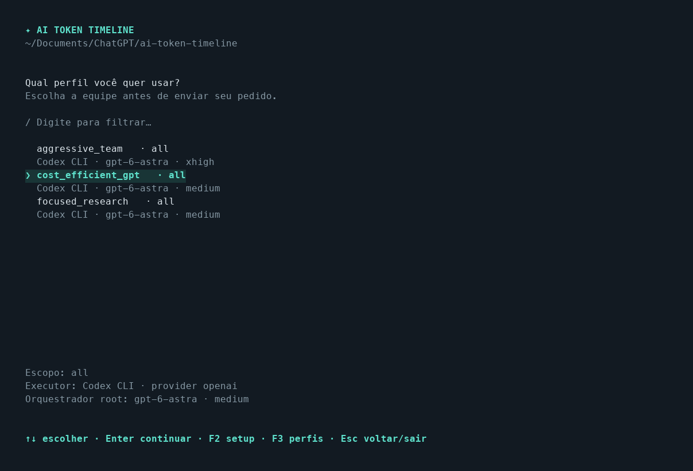

O chat organiza os **widgets no topo**, as **abas em duas linhas logo abaixo** e a conversa acima do campo de pedido. A aba fixa **Configurações** reúne Perfil, Equipe, Opções de execução, Agentes e modelos, Auxiliar e plugins, Conversas salvas, Consumo e relatórios e Créditos. Esses controles ficam nessa aba, sem uma barra de atalhos sobre a conversa.

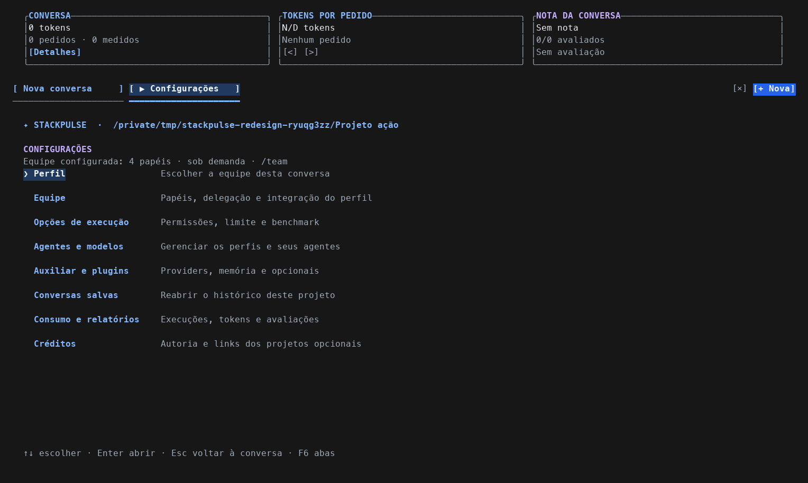

Em **Configurações → Equipe**, ou `/team`, a ficha mostra orquestrador, modelo/esforço, todos os papéis configurados (até 32), delegação, finalidades, condições e integração. `PgUp`/`PgDn` percorrem a ficha. Ela é relida ao consultar e ao retornar do setup; trocar o perfil limpa a ficha anterior. Consultar a equipe não inicia providers nem compila imagens. Uma imagem ainda não compilada aparece como **aguardando extração**; os cartões de agentes mostram somente atividade observada.

O perfil é aplicado automaticamente ao enviar um pedido: não é necessário pedir subagentes ou repetir modelos e papéis no texto. Em `on_demand`, o orquestrador delega somente o trabalho que justificar os papéis disponíveis; selecionar uma equipe não obriga a criar todos os agentes. A execução sequencial limita a equipe a um subagente por vez. O Codex recebe configurações nativas temporárias por papel; o Claude recebe os papéis por `--agents`, com modelo e esforço do perfil, sem alterar configurações salvas dos CLIs.

Equipes com provedores diferentes podem usar um root Codex ou Claude e definir `provider` em cada papel. O campo `team.provider` continua como padrão herdado. O StackPulse cria uma ponte MCP temporária que encaminha as tarefas aos CLIs correspondentes, preservando o modelo e o esforço do papel. Os filhos usam o login já configurado em cada CLI e recebem o contexto da tarefa enviado pelo orquestrador. Veja [equipes com múltiplos provedores](docs/multi-provider-teams.md).

Equipes inteiramente Claude com subagentes nativos exigem `workspace-write`; em `read-only`, a execução é recusada sem ampliar permissões. A concorrência é solicitada ao orquestrador Claude pelo prompt, sem imposição nativa pelo adaptador. Perfis com root Cursor ou Grok e subagentes ficam sinalizados para revisão e são recusados antes de iniciar o CLI: os adaptadores não garantem modelo/esforço por papel, e no Grok a configuração local pode substituir esses valores. Use Codex/Claude ou um perfil sem subagentes. Esses limites não indicam problema na instalação ou assinatura dos CLIs.

No chat, o histórico fica acima do campo de pedido. `Enter` envia; `Alt+Enter` ou `Shift+Enter` insere uma nova linha nos terminais que distinguem essas combinações. A interface solicita o protocolo de teclado aprimorado para preservar os modificadores; se o terminal ainda enviar apenas `Enter`, use `Ctrl+J` para inserir a quebra de linha. A colagem preserva quebras de linha, tabulações e Unicode, com limite de 64 KiB por pedido. Durante a execução, a tela mostra estado e tempo decorrido; a resposta aparece quando o CLI retorna, com tokens e custo quando informados. `Esc` ou `Ctrl+C` solicita o cancelamento do pedido da aba ativa e aguarda o encerramento.

Para copiar texto, pressione `F8`, selecione com o mouse e use o atalho de cópia do terminal (`Cmd+C` no macOS ou `Ctrl+Shift+C` em muitos terminais Linux/Windows). Nesse modo a tela fica congelada e o mouse fica livre para selecionar; as execuções continuam em segundo plano. `F8` ou `Esc` retoma a interação e atualiza a tela.

As **abas abaixo dos widgets** mantêm conversas independentes, cada uma com seu perfil, rascunho, histórico, posição de rolagem e execução. A aba ativa tem preenchimento, seta e sublinhado; **Configurações** permanece disponível após as conversas, inclusive quando há abas fora da área visível. Trocar de aba mantém o trabalho em segundo plano: **●** indica execução em andamento e **•** indica uma conclusão ainda não vista. `Ctrl+N` ou **[+ Nova]** abre outra conversa; `Alt+←/→` ou `F6` alterna as abas (`Shift+F6` volta). `Ctrl+W` ou **[×]** fecha uma conversa sem apagar o histórico; se estiver executando, cancele o pedido primeiro. Configurações é fixa e não pode ser fechada.

As conversas mais recentes ficam à esquerda: criar ou reabrir uma conversa e enviar um pedido a traz para o início. Apenas selecionar uma aba não muda a ordem. Clique em **[Título]** (**[T]** em terminais estreitos), pressione `F2` no chat ou use `/title` para editar seu nome. O título aceita até 80 caracteres, fica salvo no histórico e é preservado nos próximos pedidos. Sem um título personalizado, o primeiro pedido fornece o nome inicial.

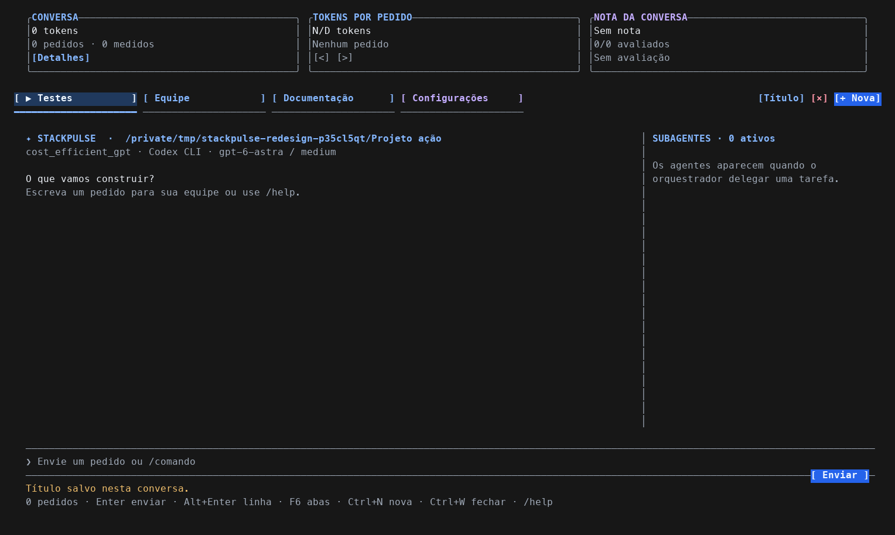

Capturas com perfis e execução simulados em ambiente temporário.

No topo, quatro widgets mostram **tokens da conversa**, **tokens do pedido selecionado**, **nota média de entrega** e **tempo médio por pedido**, exclusivos daquela conversa. Uso e ações aparecem em azul; a nota tem destaque violeta. Use **[<] / [>]** para consultar cada pedido. Clique no primeiro cartão, de consumo da conversa, ou use `F7` ou `/usage` para listar todos os pedidos, com tokens exatos e notas; **[Avaliar]** mostra todas as respostas da sessão para você escolher qual avaliar. `/clear` apenas oculta o histórico da tela e mantém os totais.

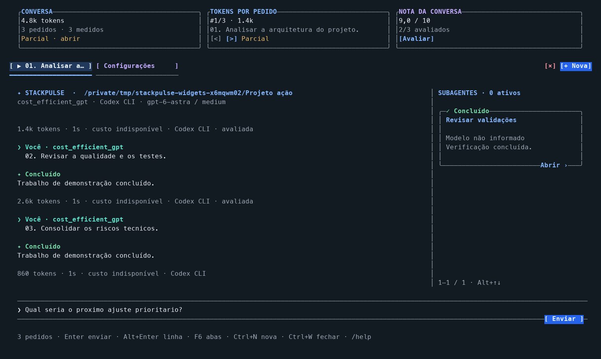

A avaliação fica no card **Nota da conversa**, disponível ao abrir o chat. Clique em **[Avaliar]** para consultar todas as respostas da sessão e selecionar um pedido concluído para registrar ou editar sua entrega, rapidez e observações. A nota permanece salva e a média é recalculada após a edição. Os controles de avaliação não são anexados às mensagens do agente.

O **tempo médio** considera a duração de ponta a ponta dos pedidos concluídos com tempo registrado, contando cada execução uma vez. Pedidos em andamento e durações ausentes ficam fora da média; sem medições, aparece **N/D**.

A nota converte a entrega de 0–1 para 0–10 e considera somente pedidos avaliados, mostrando a cobertura **x/y**. Rapidez continua separada, de 1–5. **Sem nota** e **N/D** indicam dados ausentes; totais incompletos aparecem como **parciais**. Os widgets acompanham a execução e releem avaliações alteradas em `/history` pelo banco local, sem chamar um CLI ou provider para essa consulta. Veja o [guia dos widgets](docs/terminal-interface.md#widgets-da-conversa).

No chat e em suas telas internas, o mouse permite selecionar abas e perfis, abrir conversas salvas, escolher campos, posicionar o cursor e clicar em **Enviar**, **Cancelar** ou nos agentes. A roda percorre a área sob o ponteiro. A captura é ativada automaticamente nessas telas e desativada ao sair ou abrir telas externas; `/menu` e `/setup` continuam usando teclado. Para abrir essas telas, aguarde ou cancele os pedidos de todas as abas.

Os subagentes observados aparecem em cartões à direita, com **tarefa, modelo/esforço, prévia e estado**. Clique em um cartão para abrir sua atividade e um campo de orientação de até **16 KiB**. Com esse campo focado, `Enter` ou `F5` envia a orientação; `F9` solicita **Interromper e redirecionar**, uma ação separada. `Alt+↑↓` percorre a equipe; `F4` ou `/agents` abre a lista ampliada. Em janelas estreitas ou baixas, o detalhe ocupa o corpo do chat e preserva o rascunho do pedido principal. `Esc` volta à lista ou ao chat, sem cancelar o pedido.

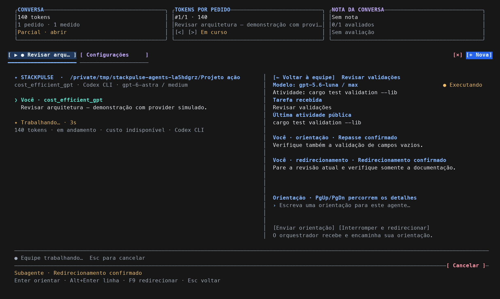

As execuções Codex iniciadas pela UI usam um **app-server privado por pedido**, com o login e as permissões da execução. As orientações seguem sempre pelo orquestrador, responsável por encaminhá-las ao agente escolhido. **Orquestrador notificado** e **Aguardando repasse** são estados intermediários; a confirmação exige um evento nativo correlacionado ao destino e à orientação enviada. O redirecionamento exige confirmação da interrupção e do repasse. Nos demais adaptadores, essas intervenções aparecem como indisponíveis. O histórico do chat salva o último snapshot de atividade e as intervenções por pedido. Veja [os controles e seus limites](docs/terminal-interface.md#acompanhar-os-subagentes).

No chat Codex, cada pedido inicia com política de aprovação `on-request`, mantendo o sandbox escolhido em `/options`. Quando o runtime precisar de autorização, o chat mostra a ação, o motivo e os detalhes: **Ctrl+Y** aprova e **Ctrl+N** nega. ↑/↓ e PageUp/PageDown percorrem detalhes longos. A aprovação vale para aquela ação; pedidos de permissões adicionais valem somente pelo turno indicado. Fechar ou interromper a execução não concede autorização. Outros adaptadores e comandos sem chat mantêm suas políticas próprias. A mudança exige uma nova execução do StackPulse atualizado; não altera sessões já iniciadas.

Use `/profile` para trocar a equipe, `/options` para ajustar benchmark, permissões e limite de tempo, e `/feedback` para avaliar o pedido selecionado e concluído. `/preview seu pedido` mostra a prévia. `/sessions` lista as conversas salvas deste projeto: selecioná-las foca a aba já aberta ou abre outra, sem reexecutar pedidos. `/new` abre uma nova aba. `/history`, `/trend` e `/report` abrem as métricas e os relatórios; `/help` lista os comandos. Digite `/` e use ↑/↓ e `Tab` para completar uma sugestão.

Respostas com blocos Mermaid completos são detectadas ao término do pedido e abrem automaticamente no navegador, com Markdown e diagramas renderizados. Não é necessário digitar um comando. O texto permanece no terminal; o caminho do HTML aparece no final da conversa. A visualização requer internet para carregar as bibliotecas. Reabrir o histórico não abre o navegador novamente.

Cada envio inclui **o histórico textual da sessão ativa** como contexto para o agente, usando o projeto e o perfil escolhidos. As conversas são salvas automaticamente em `.stackpulse/sessions/<id>.jsonl`, dentro da pasta autorizada, e podem ser reabertas com `/sessions`, inclusive após reiniciar o aplicativo ou mover a pasta com seu diretório `.stackpulse`. `/clear` apenas oculta a conversa; `/new` inicia uma sessão sem o histórico das outras abas. Cada pedido ainda inicia uma execução do CLI: a continuidade vem do texto salvo, sem retomar a sessão nativa do provider. Métricas e feedback continuam no SQLite. Abrir a interface ou escolher um perfil não chama uma LLM.

O chat requer 64×20 e respeita `NO_COLOR`. Veja o [guia da interface](docs/terminal-interface.md) para os atalhos, a seleção de equipes e os comandos administrativos.

Para acessar o painel com todos os comandos, use `/menu` no chat ou:

```sh
cargo run --release -- ui overview

# Abrir diretamente uma tela administrativa
cargo run --release -- ui profiles
cargo run --release -- ui executions
cargo run --release -- ui report
```

O painel reúne **visão geral, pedidos, perfis, execuções e feedback, tendências, relatórios, runs e anotações, comparações, tarifas, importação, sincronização, widget e setup**. Use ↑/↓ no menu, `Tab` para alternar entre menu e conteúdo, `Enter` para abrir e `Esc` para voltar. Nos formulários, `Tab` avança e `F5` executa ou salva. Esse painel requer 76×24.

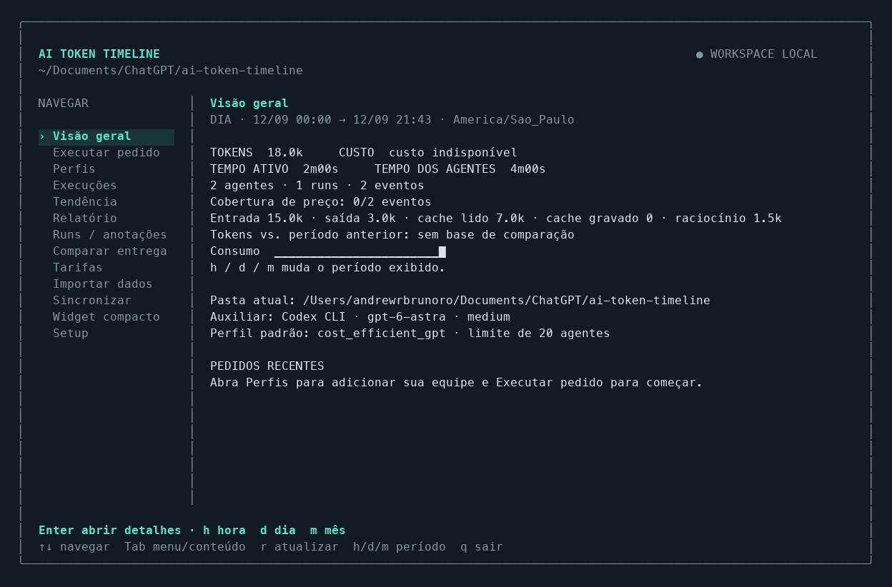

Captura do painel com dados fictícios em um banco temporário. Abrir o painel não chama os providers nem sincroniza logs; execute essas ações pelo menu quando necessário.

Para acompanhar somente o widget pequeno:

```sh
cargo run --release -- widget
```

`h`, `d` e `m` alternam hora, dia e mês do calendário; `g` alterna consumo e feedback diário com softline. `q`, `Esc` ou `Ctrl+C` encerram e restauram o terminal. Atualiza a cada 5 segundos e ocupa 11 linhas, sem limpar a tela inteira. Requer um terminal de pelo menos 32 colunas e 13 linhas. O Rust 1.93.1 fica fixado somente neste projeto.

O widget usa ciano para destacar as métricas e cinza para detalhes. `NO_COLOR=1` desativa cores; `TERM=dumb` e saída redirecionada mantêm texto simples.

```sh
# Captura estática, sem interação
stackpulse --allow-workspace "$PWD" widget --once

# Uma linha para usar no status do terminal/tmux
stackpulse --allow-workspace "$PWD" widget --line --no-sync

# Coletar primeiro, depois consultar sem ler os logs novamente
cargo run --release -- sync
cargo run --release -- runs
cargo run --release -- widget --run PREFIXO_DO_ID

# Limitar às execuções de um projeto, incluindo seus subagentes
cargo run --release -- widget --project /caminho/do/projeto

# Outro período, fuso, banco ou pasta de registros
cargo run --release -- --db data/usage.sqlite --timezone UTC widget --period month
cargo run --release -- --sessions /caminho/dos/jsonl sync

# Relatórios completos em JSON
cargo run --release -- report --period month
cargo run --release -- runs --json
```

Após `./setup.sh`, `stackpulse` abre a confirmação, o seletor e o chat; `stackpulse widget` abre somente o widget após a confirmação. Para desenvolvimento, os comandos `cargo run --release -- ...` continuam disponíveis na pasta dos fontes.

Em scripts, redirecionamentos e status de terminal, informe `--allow-workspace "$PWD"`. Essa opção global autoriza somente a pasta atual exata para aquela chamada; um caminho de pai, filho ou outro projeto é recusado. Sem terminal e sem essa opção, o programa encerra antes de acessar a configuração ou abrir o banco. `--help` e `--version` dispensam autorização. Sem subcomando, `stackpulse --allow-workspace "$PWD"` mantém a saída textual do widget quando redirecionado.

Um status de tmux pode consultar o banco com `#(stackpulse --allow-workspace "$PWD" widget --line --no-sync)`, usando a pasta atual do processo de status do tmux. Nesse modo é necessário manter um widget coletando ou executar `sync` para atualizar o banco. Não há serviço instalado em segundo plano.

## Configurar o auxiliar

```sh
cargo run --release -- setup

# Perguntas em texto, sem a interface visual
cargo run --release -- setup --plain

# Consultar os CLIs instalados sem criar configuração, banco ou pastas
cargo run --release -- setup --list-clis
cargo run --release -- setup --list-clis --json

# Selecionar diretamente um client instalado
cargo run --release -- setup --client claude
cargo run --release -- setup --client cursor
cargo run --release -- setup --client grok
```

O setup abre uma interface de terminal com cinco etapas: **CLI → Auxiliar → Projeto → Opcionais → Revisão**. Use ↑/↓ para selecionar o CLI, `Enter` para avançar pelos campos, `Tab` para alternar campos e `Ctrl+U` para limpar o campo atual. `F2` volta uma etapa; `F5` continua para a próxima etapa ou salva na revisão. `Esc` também volta uma etapa (ou sai na primeira); `Ctrl+C` cancela. As alterações são salvas apenas ao confirmar a revisão com `Enter` ou `F5`. A interface requer 56×24; `--plain` mantém o fluxo de perguntas em texto.

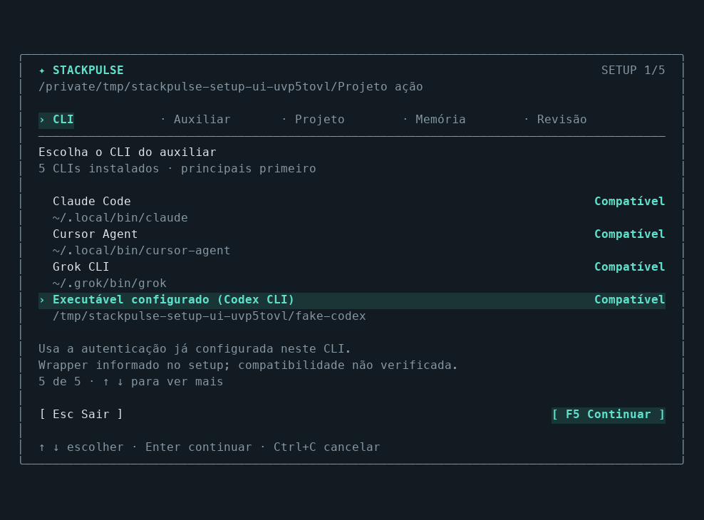

Na etapa **Opcionais**, **Instalar AI-Memory** começa marcado e **Instalar AI-UsageBar** começa desmarcado em uma configuração nova. AI-UsageBar aparece somente em uma plataforma compatível. ↑/↓ ou `Tab` escolhe o pacote; `Espaço` marca ou desmarca. O setup preserva escolhas anteriores em plataformas compatíveis. Ao confirmar a revisão, salva as preferências e instala ou reutiliza os pacotes selecionados. `--plain` oferece as mesmas escolhas com perguntas `s/n`. Alterações por flags em outros campos preservam as preferências sem iniciar downloads; `--ai-memory true` ou `--ai-usagebar true` solicita a instalação daquele pacote. Desmarcar não desinstala. A conexão da memória aos agentes e as barras gráficas do AI-UsageBar são configurações separadas.

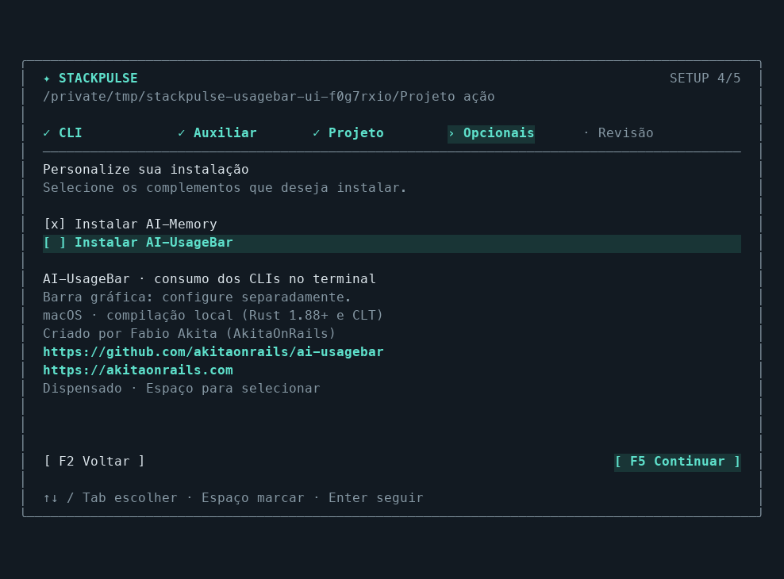

Após salvar no modo visual, a tela acompanha a preparação dos pacotes selecionados e apresenta o resultado. `PgUp`/`PgDn` percorrem os detalhes; ↑/↓ ou `Tab` seleciona **Concluir**, **Voltar ao setup** ou **Tentar novamente**, disponível em caso de falha, e `Enter` executa a ação. Durante a instalação, `Esc` ou `Ctrl+C` solicita cancelamento e aguarda o processo encerrar. A configuração salva é preservada; concluir após uma falha mantém o código de erro.

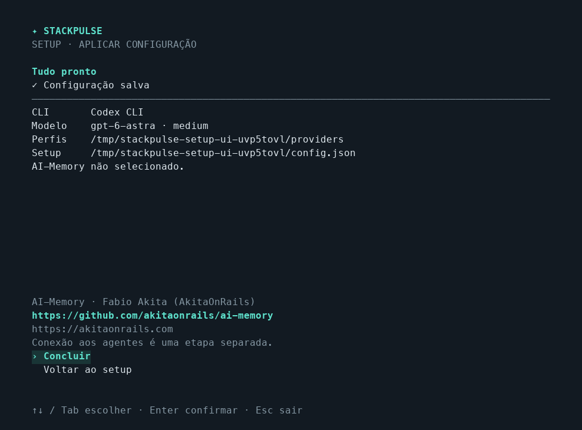

A primeira etapa mostra nome, caminho e status dos CLIs reconhecidos, começando por Codex, Claude Code, Gemini CLI, GitHub Copilot, Cursor e Grok. O catálogo também inclui OpenCode, Aider, Amp, Droid, Goose e Kiro. A descoberta procura arquivos executáveis no PATH e em pastas comuns de instalação; não executa os CLIs nem verifica login.

**Codex, Claude, Cursor e Grok** aparecem disponíveis para seleção e execução. Os outros CLIs reconhecidos aparecem como **SEM ADAPTADOR**; esse status se refere ao suporte do Timeline, não à instalação nem à assinatura. Nomes ambíguos são sinalizados.

Claude, Cursor e Grok começam com modelo e esforço `default`, que mantêm os valores configurados no próprio CLI. Ao confirmar outro client, o setup ajusta os padrões; voltar ao anterior recupera os campos que você editou. `--executable claude` também identifica o client. Para um wrapper personalizado, informe seu backend, por exemplo `setup --client claude --executable /caminho/meu-wrapper`. Veja o [guia de setup](docs/image-workflows.md#setup) para detalhes.

## O que fica salvo

- Sessões e relação pai/filho; o conjunto enraizado no orquestrador é uma execução. Uma mesma tarefa retomada continua sendo a mesma execução; os turnos individuais também ficam salvos.
- Eventos de tokens com horário, modelo, esforço e service tier; configurações antigas não são substituídas pelas configurações atuais do Codex.
- Turnos, duração observada e TTFT quando disponível.
- Anotações de benchmark, nota de qualidade e identificação de baseline.
- Tarifas com data de vigência e fonte informada.
- Execuções iniciadas pelo Timeline, com client executor, sessão do CLI, perfil usado, modelo observado quando informado, cobertura dos contadores e custo estimado reportado pelo CLI quando disponível.

Banco padrão: `~/.local/share/ai-token-timeline/usage.sqlite`. A fonte de `sync` é `$CODEX_HOME/sessions` ou `~/.codex/sessions`. Para sessões arquivadas do Codex, rode `--sessions ~/.codex/archived_sessions sync` no mesmo banco. Nenhum arquivo do Codex é alterado. O chat oferece importação explícita de transcripts JSONL do Claude Code e rollouts JSONL do Codex pela tela `/sessions`. A importação de conversas é separada do `sync` de métricas; históricos de Cursor e Grok ainda não têm adaptador de importação de conversas.

O banco de métricas guarda consumo, caminhos de projetos, IDs locais e o perfil da equipe. O histórico do chat usa **um JSONL por conversa**, em `.stackpulse/sessions/`, com formato versionado. Preserva pedidos, respostas exibidas, estados, snapshots da execução (stack, métricas e feedback disponíveis), atualizações de atividade dos agentes e intervenções. As atualizações de resposta gravam somente o trecho alterado. `.stackpulse/project.json` identifica o projeto sem depender do caminho absoluto; `.stackpulse/.gitignore` evita versionar os dados por acidente. O diretório de execução e a autorização da pasta continuam sendo os escolhidos pelo usuário. Não há descoberta automática do histórico nas pastas ancestrais.

Ao abrir o projeto, conversas antigas de `<caminho-do-banco>.chat.sqlite` associadas àquela pasta são migradas automaticamente. O SQLite anterior é preservado; sessões ainda abertas na versão antiga são adiadas até outro início. A migração mantém os IDs e não duplica conversas. Métricas e relatórios gerais continuam no banco principal.

Em **Configurações → Conversas salvas** ou `/sessions`, clique **Importar** ou **Exportar**. Também existem `/import-session` e `/export-session`. A origem é detectada automaticamente: StackPulse, Codex ou Claude Code. A importação é local, não executa mensagens, não chama LLM e não retoma o contexto nativo do cliente. Dados de uso de outros clientes ficam preservados nos registros de origem, sem convertê-los automaticamente em métricas dos widgets. Veja o [formato e a portabilidade do histórico](docs/history-jsonl.md).

`/new` começa outra sessão e `/clear` apenas oculta a conversa da tela. Conversas encerradas antes da persistência de texto não podem ser recuperadas a partir das métricas antigas. `run` e `profiles compile` enviam o pedido ou imagem pelo CLI selecionado, que pode manter seu histórico normal.

A importação é idempotente. Históricos herdados anteriores à criação do subagente são excluídos. Contadores acumulados viram deltas; repetições não geram novos eventos. A primeira amostra usa `last_token_usage` quando disponível para não incluir um saldo herdado sem histórico. Se o log começa incompleto, o consumo anterior à primeira amostra pode não estar disponível. Arquivos com linhas incompletas são relidos no próximo ciclo. O formato JSONL local é interno e pode mudar entre versões do Codex; `sync` informa problemas de leitura.

## Tokens e tempo

```text
tokens = entrada + saída
```

Cache de leitura/escrita é parte da entrada; raciocínio é parte da saída. Não são somados novamente. No widget, cache é a porcentagem de tokens de entrada reutilizados.

```text
tempo ativo = duração da união dos intervalos dos turnos
tempo dos agentes = soma da duração de cada turno
```

Vinte agentes simultâneos de um minuto representam cerca de um minuto ativo e vinte minutos de agentes. Intervalos sem turno não entram no tempo ativo. A janela recorta os intervalos que atravessam hora/dia/mês. Turnos sem encerramento acumulam tempo somente até a última telemetria daquele turno; retomar a sessão não estende um turno antigo. O prefixo `~` indica tempo incompleto. O tempo inclui ferramentas, rede e esperas dentro do turno: não é tempo de inferência isolado. `report` expõe `open_turns` e `untimed_events`.

O gráfico distribui os eventos em 24 faixas iguais entre o início da janela e agora. Tokens são atribuídos ao horário do evento registrado; não são distribuídos artificialmente ao longo da chamada.

Para Claude, Cursor e Grok, os contadores reportados são normalizados em uma sessão por invocação. Os tokens entram no horário de encerramento, e o tempo representa a duração de ponta a ponta. Um total agregado da árvore do CLI não permite inferir quantos agentes trabalharam, nem o tempo individual de cada um. A [cobertura da execução](docs/image-workflows.md#entrar-no-projeto-e-enviar-o-pedido) distingue totais da árvore, parciais, somente da raiz e indisponíveis.

O percentual de consumo compara a janela atual com o mesmo tempo decorrido da janela anterior. Se o tempo decorrido ultrapassa o tamanho da janela anterior (por exemplo, dia 31 após um mês de 30 dias), o percentual fica indisponível. Esse percentual mede volume total de uso, não eficiência nem capacidade do provedor. Dados ausentes na janela anterior também produzem “sem base anterior”.

## Custo

Nenhuma tarifa vem preenchida. O programa não trata consumo de assinatura como cobrança por token. Sem tarifa compatível para **todos** os eventos da janela, o total permanece desconhecido; `priced_events/events` mostra a cobertura.

Quando o CLI informa um custo, ele fica salvo como `reported_cost_usd`. É uma estimativa reportada pelo client, não uma cobrança adicional da assinatura. A tendência diária pode usar esse valor quando não há estimativa completa por tarifas; o widget geral continua usando as tarifas cadastradas. Totais agregados de vários modelos não são precificados como se todos os tokens pertencessem ao modelo da raiz.

Cadastre valores verificados por você, em USD por milhão de tokens:

```sh
stackpulse price --help
```

Campos obrigatórios: `--provider`, `--model`, `--effective-at` (RFC3339), `--input`, `--cached`, `--cache-write`, `--output` e `--source`. `--service-tier` é `unknown` por padrão, correspondente aos logs que não informam tier. Use o valor efetivamente registrado. Não há associação automática entre tier desconhecido e tarifa standard.

```text
custo estimado = [(entrada − cache_leitura − cache_escrita) × P_entrada
                 + cache_leitura × P_cache_leitura
                 + cache_escrita × P_cache_escrita
                 + saída × P_saída] / 1.000.000
```

O cálculo usa a tarifa compatível mais recente com vigência anterior ao evento. Tarifas de datas futuras não alteram eventos anteriores. Corrigir a tarifa da mesma data recalcula as estimativas históricas. São estimativas de tokens, não uma fatura: ferramentas pagas, faixas por tamanho de contexto, descontos, impostos e assinaturas não estão incluídos. Para uma tarifa com faixas de contexto, o MVP exige uma segmentação externa antes da importação.

## Verificar consumo e capacidade de entrega

Use uma tarefa de benchmark repetível, em sessões independentes, com a mesma versão de prompt, contexto, repositório, testes, ferramentas e concorrência. Registre essas versões no identificador do benchmark. Um exemplo de qualidade é a fração ponderada de critérios de aceitação aprovados, entre 0 e 1; mantenha os pesos e critérios fixos. Concluir um turno não equivale a entregar com qualidade.

```sh
stackpulse tag ID_BASE --label "Fábrica Astra + Luna" \
  --benchmark "suite-v1|prompt-v2|repo-a1b2|conc20" --quality 0.95 --baseline

stackpulse tag ID_ATUAL \
  --benchmark "suite-v1|prompt-v2|repo-a1b2|conc20" --quality 0.80 --current

stackpulse benchmark-compare
stackpulse benchmark-compare --json
```

A consulta histórica antes chamada `compare` passou a se chamar `benchmark-compare`.

As tags atualizam somente os campos fornecidos. A configuração comparada é derivada dos eventos e inclui quantidade de sessões, papéis root/worker, provedor, modelo, esforço e tier. Exemplo: um Astra com vinte Luna ultra forma um grupo distinto de um Astra com dez Luna. Benchmark e configuração precisam coincidir. Configuração de ferramentas, versões e concorrência precisam ser controladas pelo benchmark informado, pois não são inferidas dos tokens.

Para baseline `B` e período atual `A`:

```text
Q = média das notas de qualidade
E_tokens = soma(tokens) / soma(notas de qualidade)
Δ_tokens = 100 × (E_tokens_A / E_tokens_B − 1)
Δ_tempo = 100 × (mediana(tempo_ativo_A) / mediana(tempo_ativo_B) − 1)
Δ_qualidade = 100 × (Q_A − Q_B)  [pontos percentuais]
```

Se a soma das notas é zero, a eficiência é indefinida. Um aumento de tokens com qualidade estável sugere pior eficiência para esse benchmark; menos tokens com qualidade menor pode representar uma entrega incompleta. A duração sozinha não distingue queda de capacidade de mudanças em rede, ferramentas ou carga.

Com pelo menos cinco execuções por grupo, o programa calcula um intervalo bootstrap percentil de 95% para a diferença de qualidade, com 2.000 reamostragens determinísticas. Sinaliza investigação quando a queda média é de pelo menos 5 pontos e o limite superior do intervalo é negativo. É um sinal **exploratório**, não prova de alteração pelo provedor nem teste de equivalência: cinco amostras podem ser insuficientes, as execuções precisam ser independentes e repetir muitas comparações aumenta falsos alertas. Turnos abertos, eventos sem tempo e árvores sem raiz não entram nessa comparação. Uma análise causal exigiria controles adicionais ou informações do provedor.

## Outras fontes

`stackpulse import examples/execution.json` aceita métricas normalizadas de qualquer coletor. O exemplo contém dados fictícios e deve ser importado em um banco de demonstração:

```sh
cargo run -- --db data/demo.sqlite import examples/execution.json
cargo run -- --db data/demo.sqlite runs --json
```

IDs de uso devem identificar eventos únicos de forma estável. `input_tokens` inclui cache e `output_tokens` inclui raciocínio; o adaptador de cada provedor deve converter suas convenções. Datas são RFC3339. O coletor não chama APIs de modelos. Os comandos `run` e `profiles compile` usam os adaptadores de Codex, Claude, Cursor ou Grok e consomem o uso do client selecionado. A extração da imagem usa o auxiliar configurado; a execução escolhe o client correspondente ao provider do orquestrador e, em equipes mistas, resolve o CLI de cada papel pela ponte.

## Desenvolvimento

```sh
cargo test
cargo fmt --check
cargo clippy --all-targets -- -D warnings
```

`collector.rs`: logs Codex. `providers/`: protocolos e contadores dos outros CLIs. `runner.rs`: processos e entrada/saída. `workflow.rs`: execuções e feedback. `db.rs`: persistência e importação. `analytics.rs`: árvores, janelas, custos e comparação. `chat_ui.rs`, `chat_profiles.rs` e `chat_composer.rs`: seleção de equipes e chat. `app_ui.rs`: painel administrativo. `widget.rs` e `setup_ui.rs`: widget e configuração. `main.rs`: CLI.

Fontes de referência: [telemetria do Codex](https://learn.chatgpt.com/docs/config-file/config-advanced), [contadores da Responses API](https://developers.openai.com/api/reference/python/resources/responses/methods/retrieve) e [boas práticas de avaliações](https://developers.openai.com/api/docs/guides/evaluation-best-practices). A leitura do JSONL foi validada também contra os arquivos locais, sem assumir que todos os campos da telemetria oficial aparecem nesses arquivos.
