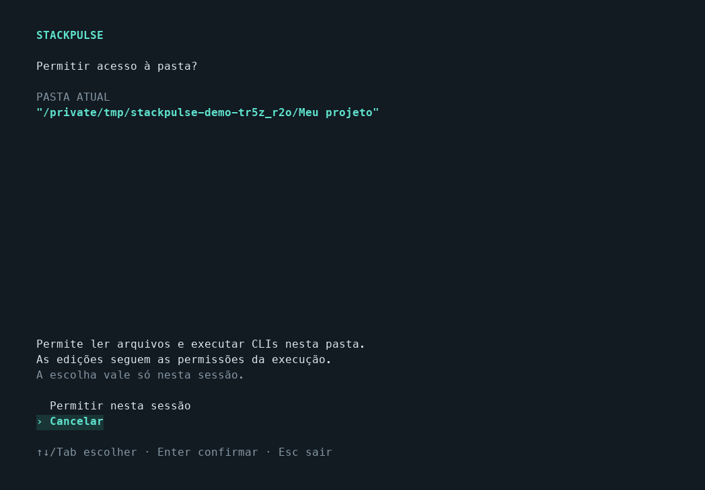
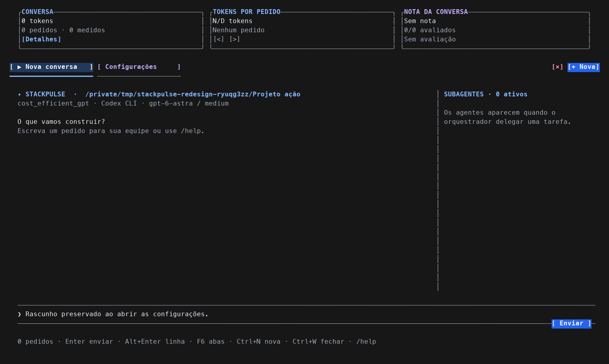
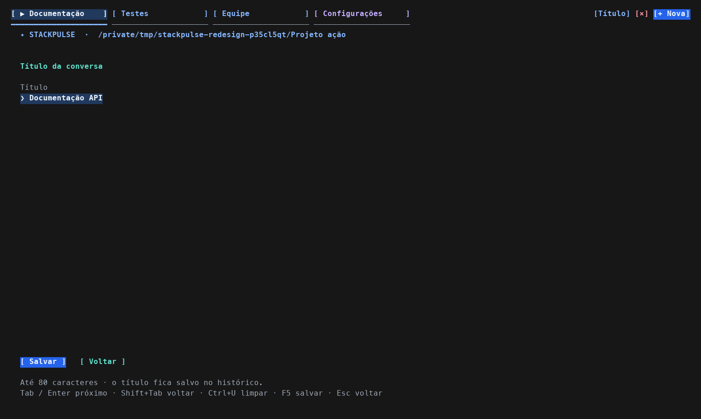
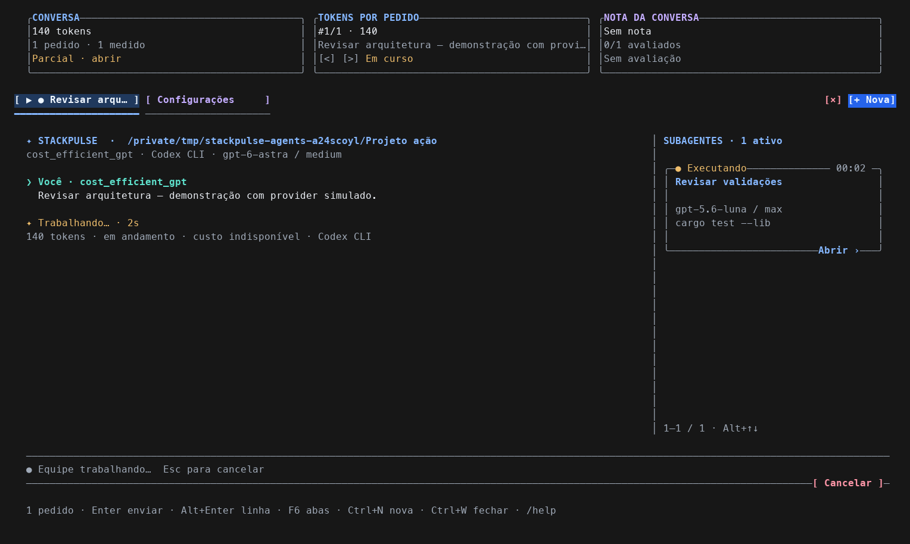

# Interface no terminal

Abra a interface na pasta do projeto:

```sh
stackpulse

# Formas equivalentes para iniciar a seleção de perfil e o chat
stackpulse ui
stackpulse ui run
```

Para iniciar o chat Codex/Grok sem sandbox e sem pedidos de aprovação:

```sh
stackpulse --no-policy
# Aliases equivalentes:
stackpulse --skip-dangerous
stackpulse --dangerously-skip-permissions
# Também aceita uma chamada explícita:
stackpulse --no-policy ui
stackpulse --no-policy run "Implemente a alteração"
```

`--no-policy` vale para os pedidos do chat e `run` nesta execução, incluindo os filhos da ponte multiprovedor. Codex recebe `danger-full-access` e aprovação `never`; Grok recebe `bypassPermissions` e sandbox `off`. Claude/Cursor ainda rejeitam esse modo. A opção não é salva, não remove políticas administradas ou permissões do sistema e não modifica sessões já abertas. Sem ela, permanece o comportamento padrão, com aprovação `on-request` no chat Codex. A autorização inicial da pasta continua necessária.

A interface usa a mesma configuração, banco, fuso e diretório do projeto que os comandos existentes. Para escolher outro ambiente:

```sh
cargo run --release -- --db data/usage.sqlite --config data/config.json --timezone UTC ui
```

O comando sem argumentos abre a interface em um terminal interativo. Com a saída redirecionada, `stackpulse --allow-workspace "$PWD"` mantém a saída textual do widget. `widget` continua sendo o comando explícito para o painel compacto; `ui overview` abre o painel administrativo com menu lateral. Para desenvolver na pasta dos fontes, use `cargo run --release -- ...`.

O chat e as telas interativas atualizam apenas as linhas alteradas, sem limpar a tela inteira a cada consulta de dados. Quando o conteúdo e o cursor permanecem iguais, nenhuma saída é enviada ao terminal. Redimensionar a janela ou voltar de outra tela reinicializa o desenho.

## Autorizar a pasta atual



A primeira tela mostra **Permitir acesso à pasta?** e o caminho completo, antes de ler configurações, perfis ou histórico. **Cancelar** vem selecionado. ↑/↓ ou `Tab` escolhe a ação; `Enter` confirma; `Esc` ou `Ctrl+C` encerra sem abrir o banco nem executar comandos. Caminhos longos podem ser percorridos com `PgUp`/`PgDn` e `Home`/`End`. A tela requer 64×20; reduzir a janela impede a confirmação até ampliar novamente. `TERM=dumb` usa uma pergunta em texto com padrão de recusa, `[s/N]`.

**Permitir nesta sessão** cobre as ações iniciadas pelo chat ou painel até sair do programa. Os comandos internos recebem a mesma pasta autorizada, sem repetir a pergunta. Uma nova chamada de `stackpulse` solicita autorização novamente.

O diretório de execução é sempre a pasta em que o usuário iniciou o comando. Instalar em `~/.local/bin` não altera esse diretório. Dentro de uma subpasta Git, a raiz do repositório determina o escopo dos perfis, mas o pedido, o CLI e o registro de métricas usam a subpasta. Links simbólicos são resolvidos e a confirmação mostra o caminho real.

Para automação sem terminal, conceda explicitamente a mesma autorização:

```sh
cd /caminho/do/seu/projeto
stackpulse --allow-workspace "$PWD" run "Revise este projeto" --no-feedback
stackpulse --allow-workspace "$PWD" widget --line --no-sync
```

`--allow-workspace` aceita somente a pasta atual exata; não aceita um pai, uma subpasta ou outro projeto. Sem a opção e sem terminal interativo, o comando encerra antes de ler configuração, perfis ou histórico. `--help` e `--version` continuam disponíveis sem confirmação.

A autorização pertence ao StackPulse e não modifica permissões do sistema. O CLI continua sujeito ao acesso que já possui e às permissões de execução escolhidas em `/options`. Configuração, perfis e histórico podem estar nos caminhos definidos no setup, fora da pasta do projeto; esta confirmação não cria um isolamento do sistema de arquivos.

## Escolher a equipe


Após autorizar a pasta, o seletor sempre pede uma escolha, mesmo quando só existe um perfil ou há um perfil padrão configurado. O padrão determina o destaque inicial, sem pular a seleção. Os perfis específicos do projeto têm prioridade sobre os perfis de `all` com o mesmo nome.

| Tecla | Ação |
| --- | --- |
| Digitar | Filtrar os perfis disponíveis |
| ↑ / ↓ | Selecionar um perfil |
| Enter | Escolher a equipe e abrir o chat |
| F2 | Abrir o assistente de setup dos CLIs |
| F3 | Abrir o gerenciamento de imagens e perfis |
| Ctrl+R | Reler a configuração e os perfis |
| Esc | Voltar ao chat, se já houver uma equipe escolhida; caso contrário, sair |

Uma imagem ainda sem Markdown pode ser selecionada. Ela é compilada pelo auxiliar quando o primeiro pedido é enviado. Selecionar a imagem, filtrar a lista ou abrir a interface não chama uma LLM. Um Markdown inválido, incompleto ou cuja imagem mudou fica bloqueado até ser corrigido ou recompilado pelo gerenciamento de perfis.

Se não houver configuração ou perfis, use `F2` para configurar o auxiliar e `F3` para adicionar uma imagem. Os clientes de execução reutilizam o login existente no CLI. A compilação usa o auxiliar configurado; o provider da equipe determina o cliente que executa os pedidos.

## Enviar pedidos no chat



Capturas com perfis e execução simulados em ambiente temporário.

O chat mostra os widgets no topo, as abas em duas linhas logo abaixo e os pedidos e respostas acima do campo de texto. O perfil escolhido permanece ativo para os próximos envios. A aba fixa **Configurações** concentra os controles de perfil, equipe e execução, sem uma barra de atalhos sobre a conversa. Uma imagem sem perfil compilado aparece como **aguardando extração da imagem**.

O campo de texto destaca **SEU PEDIDO** e muda para **EM EXECUÇÃO** durante o trabalho da equipe. A borda inferior mantém o atalho de nova linha junto da ação de enviar ou cancelar. Quando há mais mensagens que espaço disponível, a borda superior indica a posição de leitura; `PgUp` e `PgDn` percorrem as mensagens.

Use **Configurações → Equipe** ou `/team` para abrir a ficha do perfil ativo na área rolável da conversa. Ela mostra o arquivo e o escopo, o executor, o orquestrador com modelo/esforço, todos os papéis configurados (até 32), o modo de delegação, suas finalidades e condições, além da integração e das notas do perfil. `PgUp`/`PgDn` percorrem a ficha; `Esc` fecha. A consulta começa no início da ficha, mesmo após uma conversa longa, e não altera os pedidos anteriores.

`/team` relê o perfil e a configuração local. Ao retornar do setup, uma ficha aberta também é atualizada. Trocar a equipe altera os próximos pedidos e limpa a ficha anterior. Essas ações não iniciam providers, não extraem imagens nem criam registros de execução. Os papéis configurados não geram cartões: `/agents` continua reservado aos agentes observados.

Ao enviar um pedido, as regras do perfil são aplicadas automaticamente. Não é necessário instruir o orquestrador a usar subagentes nem repetir a equipe no prompt. Em `on_demand`, ele usa apenas os papéis necessários; a existência de um papel não obriga a criar um agente. No modo sequencial, o limite é um subagente por vez.

O Codex recebe arquivos temporários com as configurações nativas dos papéis. O Claude recebe a equipe por `--agents`, com modelo e esforço por papel. Essas configurações valem para a execução e não alteram arquivos salvos dos CLIs. A concorrência no Claude é uma instrução ao orquestrador, sem imposição nativa pelo adaptador. Equipes Claude com subagentes exigem `workspace-write`; usar `read-only` em `/options` faz a execução ser recusada, sem ampliar as permissões.

Perfis com subagentes usando Cursor ou Grok como **orquestrador** aparecem com **Revisão necessária** e são recusados antes de iniciar o CLI. Esses adaptadores ainda não garantem modelo/esforço por papel; no Grok, a configuração local pode substituir os valores do perfil. A orientação é usar Codex/Claude como orquestrador ou um perfil sem subagentes. Essa restrição não impede filhos Grok em equipes multiprovedor, executados pela ponte MCP `stackpulse_team` sob um orquestrador Codex ou Claude. Esse aviso descreve o suporte à equipe, não a instalação ou assinatura dos CLIs.

`Enter` envia o pedido. `Alt+Enter` ou `Shift+Enter` insere uma nova linha quando o terminal informa a combinação separadamente. A interface solicita o protocolo de teclado aprimorado para preservar os modificadores. Se o terminal ainda enviar essas combinações como `Enter`, use `Ctrl+J` para inserir uma nova linha. A colagem preserva Unicode, quebras de linha e tabulações. O pedido aceita até **64 KiB**; se uma colagem ultrapassar o limite, ela é recusada por inteiro e o texto anterior permanece no campo. `Ctrl+U` limpa o pedido. Com o campo vazio, ↑ recupera o pedido anterior para edição; ↑/↓ percorrem os pedidos da sessão. `PgUp` e `PgDn` percorrem a conversa.

Cada envio inclui **o histórico textual da sessão ativa** como contexto, junto do pedido atual, usando o projeto e o perfil selecionados. Isso mantém a continuidade ao trocar de perfil, usar `/clear` ou reabrir a conversa com `/sessions`, inclusive após reiniciar o aplicativo. `/new` começa uma conversa sem o histórico das outras abas. Cada pedido inicia uma execução do CLI; não retoma sua sessão nativa nem restaura estados internos de ferramentas.

O histórico de texto é salvo localmente em `.stackpulse/sessions/<id>.jsonl`, dentro da pasta autorizada, separado do SQLite de consumo e feedback. O agente recebe os pedidos, as respostas e os estados registrados da conversa. Novas prévias ficam fora do contexto dos próximos pedidos, pois não são respostas do agente. Prévias antigas registradas apenas como “Concluído” não podem ser distinguidas automaticamente de respostas. As novas respostas são preservadas por inteiro ao finalizar; trechos omitidos por versões anteriores não podem ser recuperados automaticamente. Conversas antigas que existiam apenas em memória não podem ser recuperadas. O contexto enviado continua sujeito à capacidade do modelo escolhido e ao limite de 1 MB da entrada do executor, incluindo as instruções do perfil. Se exceder esse limite, o envio informa o erro e preserva o histórico; use `/new` para começar outra conversa.

Enquanto o pedido está em execução, o chat mostra o estado e o tempo decorrido. A resposta aparece quando o CLI retorna. Tokens e custo aparecem quando são informados pelos registros ou pelo cliente. Uma métrica ausente permanece indisponível.

Durante a execução, `Esc` ou `Ctrl+C` no chat solicita cancelamento do pedido da aba ativa e aguarda o encerramento e a gravação do resultado. Nos detalhes de um agente, `Esc` apenas volta à lista ou ao chat; na lista ampliada, retorna ao chat. Fechar esses detalhes não cancela o pedido nem envia o texto de orientação. Fora de uma execução, `Esc` no chat limpa o pedido atual e os avisos; `/exit` sai da interface. Cancelar uma execução não apaga seu registro.

## Abas e mouse


As abas ocupam duas linhas abaixo dos widgets: rótulo e sublinhado. A ativa usa fundo azul e uma seta; os marcadores continuam visíveis com `NO_COLOR`. **Configurações** permanece fixa após as conversas, inclusive quando a lista de abas precisa de setas para mostrar as demais. Ao alternar conversas, cada uma preserva perfil, rascunho e cursor, histórico, posição de rolagem, opções e atividade dos agentes. Os pedidos continuam executando em segundo plano. **●** indica trabalho em andamento; **•** sinaliza uma conclusão ainda não vista.

| Ação | Teclado ou mouse |
| --- | --- |
| Copiar texto pela seleção do terminal | `F8`, selecionar e usar o atalho de cópia; `F8` ou `Esc` para voltar |
| Nova conversa | `Ctrl+N`, `/new` ou **[+ Nova]** |
| Editar título da conversa | **[Título]** (ou **[T]** em terminal estreito), `F2` no chat ou `/title` |
| Selecionar pela posição visível | `Alt+1` a `Alt+9`, na ordem das conversas |
| Próxima aba | `Alt+→`, `F6` ou clicar na aba |
| Aba anterior | `Alt+←`, `Shift+F6` ou clicar na aba |
| Fechar aba | `Ctrl+W` ou **[×]** |
| Abrir configurações | Clicar em **Configurações** ou usar `/settings` |

Fechar uma conversa preserva seu histórico. Uma aba com pedido em execução não pode ser fechada: cancele o pedido e aguarde o encerramento antes de fechar. Configurações é fixa e não pode ser fechada. Trocar de aba não cancela nada. Sair do StackPulse encerra os pedidos restantes de todas as abas e preserva os registros.

As conversas ficam ordenadas da mais recente para a mais antiga, da esquerda para a direita. Criar uma conversa, reabrir uma conversa fechada ou enviar um pedido a traz para o início. Selecionar abas, receber atualizações de execução e editar títulos preservam a ordem; os atalhos e as setas acompanham essa ordem visual.

**Título** abre um formulário local. Use **Salvar** ou `F5` para confirmar e **Voltar** ou `Esc` para cancelar, preservando o rascunho do pedido. O nome aceita até 80 caracteres, é salvo no histórico e pode ser alterado durante uma execução. O título personalizado permanece nos próximos pedidos; sem edição, o primeiro pedido fornece o nome inicial. Renomear não chama um provider nem muda a tarefa em execução.



O mouse funciona no chat e em suas telas internas: abas, configurações, seleção de perfil, lista de conversas, formulários, campo de pedido, **Enviar**, **Cancelar** e cartões dos agentes. Clique no campo para posicionar o cursor; use a roda para percorrer a área sob o ponteiro, incluindo listas, conversa e agentes. O teclado continua disponível. Para copiar, pressione `F8`: a captura do mouse é desativada e a tela fica congelada para permitir a seleção nativa. Arraste sobre o texto e use o atalho de cópia do terminal (`Cmd+C` no macOS ou `Ctrl+Shift+C` em muitos terminais Linux/Windows). `F8` ou `Esc` encerra o modo de cópia e atualiza a tela. As execuções continuam em segundo plano durante a seleção. Se o seu terminal permitir, `Shift` ao arrastar também seleciona texto sem entrar nesse modo.

Fora do modo de cópia, a captura do mouse é ativada automaticamente nessas telas e desativada ao sair ou navegar para telas externas. O painel administrativo, o setup e o widget continuam com seus controles de teclado. Para abrir essas telas, aguarde ou cancele os pedidos de **todas as abas**; assim, a navegação não suspende o acompanhamento de trabalhos em segundo plano.

## Configurações da conversa


A aba **Configurações** reúne **Perfil**, **Equipe**, **Opções de execução**, **Agentes e modelos**, **Auxiliar e plugins**, **Conversas salvas**, **Consumo e relatórios** e **Créditos**. Use ↑/↓ e `Enter`, ou clique em uma opção. `Esc` volta à conversa. Os comandos equivalentes continuam disponíveis para quem prefere digitá-los.

**Agentes e modelos** abre o gerenciamento dos perfis e seus papéis; **Equipe** consulta a configuração selecionada. A lista de agentes em execução é acessada pelos cartões ou por `F4`. Abrir Configurações mantém os pedidos ativos; ações que exigem sair do chat ou alterar a execução respeitam os bloqueios apresentados pela interface.

## Widgets da conversa


Quatro cartões ficam lado a lado no topo, acima das abas, com dados exclusivos da conversa ativa:

| Widget | Conteúdo |
| --- | --- |
| Total da conversa | Soma dos tokens disponíveis dos pedidos, contando cada execução uma vez |
| Tokens por pedido | Consumo do pedido selecionado; **[<] / [>]** percorrem os pedidos |
| Nota média | Média das entregas avaliadas, de 0 a 10, e cobertura **x/y** de pedidos avaliados |
| Tempo médio | Média da duração de ponta a ponta dos pedidos concluídos com tempo registrado |

Os cartões ocupam cinco linhas; em terminais com menos de 28 linhas, usam a versão compacta de três linhas. As abas ficam imediatamente abaixo. Os títulos de uso e as ações são azuis, a nota tem destaque violeta e os estados usam âmbar ou verde, acompanhados de texto. Trocar de aba preserva a seleção do pedido e mostra os números da outra conversa.

Clique no primeiro cartão, de consumo da conversa, pressione `F7` ou digite `/usage` para abrir a lista de todos os pedidos, com tokens exatos e notas. **[Avaliar]** mostra todas as respostas da sessão, incluindo as ocultadas por `/clear`, para escolher qual avaliar. Pedidos em andamento ou sem uma execução registrada aparecem na lista, mas não podem receber nota. `/feedback` abre diretamente a avaliação do **pedido selecionado**, que precisa ter uma execução concluída. Selecionar um pedido antigo permite avaliar ou corrigir sua nota sem alterar a avaliação do último pedido.

Na lista de respostas, selecione um pedido para ler seu contexto e a resposta completa no painel. Use `PgUp`/`PgDn` ou a roda do mouse para percorrer o conteúdo.

A nota aparece no card **Nota da conversa** ao abrir o chat. Seus controles ficam no card, sem uma linha de avaliação anexada às respostas do agente. Após escolher uma resposta na lista de **[Avaliar]**, o formulário permite editar entrega, rapidez e observações do pedido selecionado; a média é atualizada após salvar e as avaliações permanecem disponíveis ao reabrir a conversa.

A nota de cada pedido é **entrega × 10**: entrega `0,8` corresponde a `8/10`. A média considera apenas os pedidos com avaliação; **x/y** informa quantos foram avaliados. Pedidos sem avaliação mostram **Sem nota** e não entram como zero. A rapidez de 1 a 5 é registrada separadamente e não altera essa média.

O **tempo médio** soma as durações registradas e divide pelo número de pedidos concluídos com duração disponível, contando cada execução uma vez. Pedidos em andamento e durações ausentes ficam fora do cálculo; uma duração registrada de zero é válida. Sem medições, aparece **N/D**.

Tokens ausentes aparecem como **N/D**. Quando faltam medições ou a cobertura é incompleta, o total é sinalizado como **parcial**. Os valores são atualizados durante a execução e ao reler avaliações alteradas em `/history` ou no banco principal. Essa consulta usa somente leituras locais, sem iniciar CLI ou provider. `/clear` apenas oculta o histórico da tela: os pedidos, o consumo e as avaliações continuam nos widgets; `/sessions` permite mostrar a conversa novamente.

## Histórico de sessões

No chat, `/sessions` abre a lista de conversas salvas da pasta atual. Use ↑/↓ para escolher, `Enter` ou clique para reabrir e `Esc` para voltar. Se a conversa já está aberta, a interface foca sua aba; caso contrário, abre outra. O histórico permanece disponível ao sair e iniciar o StackPulse novamente. Cada pedido anterior mantém o nome do perfil usado. Uma sessão aberta em outro terminal fica bloqueada pelo sistema operacional para evitar gravações simultâneas. O bloqueio é liberado mesmo se o processo terminar inesperadamente.

**Importar** (`I`) e **Exportar** (`E`) ficam no topo da lista de conversas. O formulário aceita caminhos com espaços, relativos à pasta atual ou começando com `~/`. A importação reconhece JSONL do StackPulse, Codex e Claude Code. `F5` ou o botão confirma a operação local; `Esc` volta sem executar pedidos. Arquivos de origem e destinos já existentes são preservados. A exportação usa a conversa selecionada na lista. Fora dela, `/export-session` usa a conversa ativa. Consulte o [formato JSONL](history-jsonl.md) para limites e portabilidade.

`/new` abre outra aba e preserva a anterior. `/clear` oculta o histórico da tela sem apagar pedidos, registros ou totais dos widgets; selecione a mesma conversa em `/sessions` para mostrar o histórico na aba já aberta. `/history` continua abrindo o painel de consumo e feedback.

A gravação começa antes de iniciar o pedido e acompanha o resultado da execução. Ao recuperar uma sessão encerrada inesperadamente, pedidos sem conclusão aparecem como interrompidos. Reabrir o histórico não reinicia esses pedidos nem faz chamadas ao provider.

## Acompanhar os subagentes

Em terminais com pelo menos **110 colunas**, o chat mostra um painel à direita. Cada delegação observada cria um cartão com o título da tarefa, modelo e esforço informados pelo CLI, uma prévia da atividade e o estado atual. O campo de pedido continua ocupando a largura do terminal. Os cartões são atualizados durante o trabalho, sem aguardar a resposta final do orquestrador.

O canto superior direito de cada cartão mostra o **tempo decorrido do subagente**, em `MM:SS` ou `H:MM:SS` (com dias em execuções mais longas). O contador começa na primeira observação daquele agente e fica fixo ao concluir, falhar ou cancelar; a duração é preservada no histórico. Se o mesmo agente retomar o trabalho, o total continua desde a primeira observação, incluindo a pausa. `--:--` indica que não há informação temporal suficiente, inclusive em registros antigos ou recuperados sem confirmação de encerramento.



Use `Alt+↑` e `Alt+↓` para percorrer equipes maiores. `F4` ou `/agents` abre a lista ampliada, também em terminais de 64×20 sem espaço para a lateral. Clique em um cartão para abrir seus detalhes; `Esc` volta à lista ou ao chat, sem cancelar a execução. Os últimos cartões permanecem disponíveis após concluir. Um novo pedido, a seleção de um perfil ou `/clear` limpa a visualização do painel; os registros já salvos continuam associados ao pedido.

Somente subagentes observados aparecem. Ter um papel no perfil não cria um cartão. Modelo ausente fica como **Modelo não informado**; o modelo planejado não substitui esse dado. A prévia mostra comandos, arquivos ou mensagens públicas de atividade. Registros de raciocínio não são exibidos. Concluir o pedido do orquestrador não é tratado como prova de que cada subagente concluiu: quando falta confirmação, seu estado fica indisponível.

No Codex, o painel combina os eventos de delegação do CLI com a leitura incremental dos registros da sessão raiz e de seus descendentes na pasta `--sessions`. Só as sessões associadas à execução atual alimentam os cartões. A configuração efetiva do filho fornece o modelo e o esforço; o histórico herdado do pai é descartado. No Claude, o painel usa as delegações e atividades emitidas pelo próprio stream. Cursor e Grok mostram a indisponibilidade de telemetria de subagentes quando o stream não fornece atribuição suficiente.

O transporte da atividade usa um arquivo temporário privado por pedido, removido ao encerrar esse comando. O chat grava as mudanças de **snapshot de atividade** no JSONL da conversa em `.stackpulse/sessions/`, associadas ao pedido, junto das intervenções e seus estados. Ao reabrir, usa o snapshot mais recente dos cartões. São atualizações observadas pela UI, não um log de todos os eventos internos do provider. Consultar os cartões ou reler esse histórico não chama uma LLM.

### Orientar um agente


Os detalhes mostram a atividade pública do agente e um campo de orientação, com limite de **16 KiB por envio**. Uma tentativa acima desse limite preserva o rascunho e mostra o erro. Com o campo de orientação focado, use:

| Ação | Controle |
| --- | --- |
| Enviar orientação | `Enter`, `F5` ou **Enviar orientação** |
| Interromper a tarefa do alvo e orientar novamente | `F9` ou **Interromper e redirecionar** |
| Inserir nova linha | `Alt+Enter`, `Shift+Enter` ou `Ctrl+J` |
| Percorrer a atividade e as intervenções | `PgUp` / `PgDn` ou roda do mouse |
| Voltar sem cancelar o pedido | `Esc` ou **Voltar à equipe** |

Enviar e redirecionar são ações separadas. Digitar ou fechar os detalhes não executa nenhuma delas. Em terminais com menos de 110 colunas ou 28 linhas, os detalhes ocupam o corpo do chat; o compositor principal fica oculto e seu rascunho é preservado. Ao voltar, ele reaparece com o texto anterior.

As execuções Codex da UI usam um **app-server privado por pedido**, preservando o login e as permissões da execução. Toda orientação é enviada ao **orquestrador**, que faz o repasse ao subagente escolhido; o StackPulse não injeta entrada diretamente nas sessões dos filhos. **Orquestrador notificado** e **Aguardando repasse** indicam apenas que o orquestrador aceitou a solicitação.

No chat Codex, cada pedido inicia com política de aprovação `on-request`, mantendo o sandbox escolhido em `/options`. Quando o runtime precisar de autorização, o chat mostra a ação, o motivo e os detalhes: **Ctrl+Y** aprova e **Ctrl+N** nega. ↑/↓ e PageUp/PageDown percorrem detalhes longos. Confirmações simples de ferramentas MCP (`mcpServer/elicitation/request`, formulário sem campos) também aparecem nessa tela, com servidor, mensagem e detalhes completos. Ctrl+Y autoriza somente aquela chamada, sem salvar autorização permanente; formulários com campos e fluxos por URL não são respondidos por esse painel. A aprovação vale para aquela ação; pedidos de permissões adicionais valem somente pelo turno indicado. Fechar ou interromper a execução não concede autorização. Outros adaptadores e comandos sem chat mantêm suas políticas próprias. A mudança exige uma nova execução do StackPulse atualizado; não altera sessões já iniciadas.

**Repasse confirmado** exige um evento nativo correlacionado à chamada, ao agente de destino e ao texto integral da orientação. **Redirecionamento confirmado** exige a confirmação da interrupção e do novo repasse. Uma afirmação textual do orquestrador não substitui esses eventos, e confirmar o repasse não comprova a conclusão do trabalho. Sem confirmação suficiente, a interface informa **Sem confirmação** e não reenvia automaticamente.

Nos adaptadores Claude, Cursor e Grok, essas intervenções estão **indisponíveis**, com o motivo apresentado na tela. Os controles também são desabilitados quando a execução termina ou está sendo cancelada. O histórico registra a orientação, o agente de destino, a ação solicitada e o último estado recebido de cada intervenção, vinculados ao pedido no banco do chat. Métricas e feedback permanecem no banco de consumo; o trabalho iniciado por uma intervenção usa o provider normalmente.

## Comandos do chat

Digite `/` para ver sugestões. Use ↑/↓ para selecionar e `Tab` para completar; `Enter` executa o comando digitado.

| Comando | Ação |
| --- | --- |
| `/settings` | Abrir a aba fixa de Configurações |
| `/profile` ou `/profiles` | Voltar à seleção e trocar a equipe |
| `/options` | Ajustar benchmark, permissões, limite em segundos e modo de prévia dos próximos pedidos |
| `/skip-dangerous [on\|off]` | Sem argumento ou com `on`, ativar o modo sem sandbox/aprovações para os próximos pedidos Codex/Grok em todas as abas; `off` restaura as permissões configuradas. Aliases: `/no-policy` e `/dangerously-skip-permissions`. Não altera execuções iniciadas nem persiste ao fechar o aplicativo |
| `/agents` | Ampliar ou recolher o painel de subagentes observados na última execução |
| `/team` | Mostrar a configuração completa da equipe do perfil ativo, sem executar agentes |
| `/feedback` | Registrar ou editar entrega, rapidez e nota do pedido selecionado e concluído |
| `/usage` | Listar todos os pedidos da conversa, com tokens exatos e notas; também disponível em `F7` |
| `/sessions` | Listar conversas JSONL; importar ou exportar pelo topo da tela |
| `/import-session` | Abrir o formulário de importação de conversa |
| `/export-session` | Exportar a conversa ativa em JSONL |
| `/new` | Abrir uma nova aba de conversa, preservando as demais |
| `/title` | Editar e salvar o título da conversa atual |
| `/history` | Abrir o painel de execuções, incluindo consumo e feedback de sessões anteriores |
| `/trend` | Abrir as tendências de entrega e rapidez |
| `/report` | Abrir o relatório de tokens, tempo e custo |
| `/setup` | Abrir a configuração do auxiliar e a seleção dos pacotes opcionais |
| `/update` | Recompilar os fontes locais e atualizar o StackPulse instalado; reabra o aplicativo ao concluir |
| `/menu` | Abrir o painel administrativo com todos os comandos |
| `/widget` | Abrir as opções do widget compacto |
| `/preview seu pedido` | Mostrar o pedido montado sem executar o provider |
| `/clear` | Ocultar o histórico da tela, preservando pedidos, registros e totais dos widgets |
| `/credits` | Mostrar AI-Memory e AI-UsageBar, autoria, links e escopo da integração |
| `/help` | Mostrar comandos e atalhos |
| `/exit` | Sair da interface |

`/credits` identifica **[AI-Memory](https://github.com/akitaonrails/ai-memory)** e **[AI-UsageBar](https://github.com/akitaonrails/ai-usagebar)**, criados por **[Fabio Akita (AkitaOnRails)](https://akitaonrails.com)**. O StackPulse instala os pacotes, mas ainda não configura a conexão MCP, os hooks dos CLIs nem um serviço de memória. A barra gráfica do AI-UsageBar também é configurada separadamente. O pacote disponível não é apresentado como memória ativa. Consultar os créditos é uma ação local e não chama uma LLM.

Em `/options` e `/feedback`, `Tab` ou `Enter` avança entre os campos; `Shift+Tab` volta. `F5` salva, ou avance até a ação de salvar e pressione `Enter`. `Esc` fecha o formulário. Entrega varia de 0 a 1, rapidez de 1 a 5; a observação em texto é opcional. O feedback fica vinculado ao ID da execução selecionada, junto do consumo e da duração. Para avaliar uma execução de outra sessão, use `/history`.

Uma prévia não cria uma execução para avaliar. O comando `/preview` precisa de um perfil Markdown válido; se houver apenas uma imagem, compile-a pelo gerenciamento de perfis antes de pedir a prévia.

Respostas com blocos Mermaid completos são detectadas ao término do pedido e abrem automaticamente no navegador, com Markdown e diagramas renderizados. Não é necessário digitar um comando. O texto permanece no terminal; o caminho do HTML aparece no final da conversa. A visualização requer internet para carregar as bibliotecas. Reabrir o histórico não abre o navegador novamente.

## Selecionar os pacotes opcionais


`/setup` abre **CLI → Auxiliar → Projeto → Opcionais → Revisão**. O cabeçalho mostra a etapa e uma barra de progresso; o campo ativo fica destacado. A revisão agrupa auxiliar, projeto/equipe e complementos, usando duas colunas a partir de 78 colunas de terminal. `Enter` avança pelos campos, `F2` volta uma etapa e `F5` continua para a próxima etapa ou salva na revisão. `Esc` também volta uma etapa e `Ctrl+C` cancela o setup. O assistente requer 56×24; as telas de progresso e resultado requerem 56×20.

Na etapa **Opcionais**, uma configuração nova apresenta:

```text
[x] Instalar AI-Memory
[ ] Instalar AI-UsageBar
```

AI-UsageBar aparece somente quando a instalação é compatível com a plataforma detectada. ↑/↓ ou `Tab` seleciona o pacote; `Espaço` marca ou desmarca e `Enter` avança. Os detalhes da opção selecionada mostram seu propósito, o criador e os links. As escolhas anteriores são preservadas em plataformas compatíveis. As preferências são salvas ao confirmar a revisão com `Enter` ou `F5`, quando os pacotes selecionados são instalados ou reutilizados. Em `Settings`, `ai_memory` tem padrão `true` e `ai_usagebar` tem padrão `false`, inclusive para arquivos antigos sem esses campos. Desmarcar preserva instalações existentes.

Depois de salvar, a tela mostra o progresso da instalação e seu resultado. `PgUp`/`PgDn` percorrem os detalhes. Use ↑/↓ ou `Tab` para escolher **Concluir** ou **Voltar ao setup**, e `Enter` para executar. Uma falha acrescenta a opção **Tentar novamente**. Durante a instalação, `Esc` ou `Ctrl+C` solicita cancelamento e aguarda o processo encerrar. A configuração salva permanece disponível. Concluir após uma falha mantém o código de erro do comando.


No terminal, `stackpulse setup --plain` oferece as mesmas escolhas em perguntas `s/n`, respeitando a compatibilidade do AI-UsageBar. `stackpulse setup --ai-memory true` e `stackpulse setup --ai-usagebar true` salvam a preferência e instalam o respectivo pacote; usar `false` salva a opção desmarcada. Alterar outros campos por flags preserva as preferências sem iniciar downloads.

Durante `./setup.sh`, **uma única página de plugins** aparece após o build, com AI-Memory marcado e AI-UsageBar desmarcado, este somente em plataformas compatíveis. ↑/↓ ou `Tab` move o foco; `Espaço` alterna a opção editável e `Enter` confirma todas as escolhas. Os detalhes, o criador e os links mudam conforme o plugin em foco. O seletor requer 56×20. A instalação e o progresso de cada pacote acontecem depois dessa confirmação conjunta.


`--with-memory` e `--without-memory` fixam a escolha da memória; `--with-usagebar` e `--without-usagebar` fixam a escolha do monitor de consumo. Opções definidas por flag aparecem como fixas quando houver outra opção editável na página. Quando ambas as escolhas são explícitas, a seleção é pulada, como em `./setup.sh --without-memory --with-usagebar`. As preferências são independentes; não combine flags opostas do mesmo pacote.

`Esc` dispensa somente as opções editáveis, mantendo as escolhas fixadas por flags. `Ctrl+C` interrompe a seleção antes da instalação de qualquer plugin; o comando StackPulse já instalado continua disponível. Sem terminal interativo, são mantidos os padrões e as flags: AI-Memory selecionado e AI-UsageBar dispensado quando não houver escolha explícita. Em `TERM=dumb` com terminal interativo, a página vira uma lista conjunta em texto: o número alterna uma opção editável, `Enter` confirma e `q` dispensa as editáveis. Prefira flags explícitas em scripts.

Para instalar depois ou repetir uma tentativa, use `stackpulse memory install`. `--prefix DIRETÓRIO` escolhe o local e `--select` mostra a seleção antes de instalar. Em um terminal interativo, o comando acompanha o download e apresenta o resultado na mesma interface de 56×20, com **Concluir** e, em caso de falha, **Tentar novamente**. Sem terminal interativo, mantém a saída textual. O comando usa a mesma confirmação de acesso à pasta dos demais comandos. O pacote oficial v2.2.1 tem SHA256 verificado; um AI-Memory existente no destino ou no PATH é reutilizado. Veja [instalação, plataformas e créditos](../README.md#memória-e-créditos) para os detalhes. A conexão aos agentes continua sendo uma etapa separada.

### AI-UsageBar: compatibilidade e instalação

O **[AI-UsageBar](https://github.com/akitaonrails/ai-usagebar)** é um projeto de **[Fabio Akita (AkitaOnRails)](https://akitaonrails.com)**. O StackPulse oferece a instalação do CLI e do TUI nestes ambientes:

| Plataforma detectada | Método |
| --- | --- |
| Linux x86_64 com glibc 2.34+ | Pacote binário oficial |
| Linux aarch64 com glibc 2.18+ | Pacote binário oficial |
| macOS Intel ou Apple Silicon | Compilação local; requer Rust 1.88+, Cargo e Command Line Tools |

A opção fica oculta em Linux com musl, arquiteturas não listadas e outros sistemas. A detecção não executa aplicativos nem acessa providers. O projeto oficial também funciona no Windows; a instalação automática do StackPulse é que está limitada aos ambientes da tabela. O TUI não exige Waybar ou um desktop específico.

Use `stackpulse usagebar install --select` para abrir o checkbox desmarcado ou `stackpulse usagebar install` para solicitar a instalação diretamente. `--prefix DIRETÓRIO` escolhe o destino. A seleção, o progresso, a conclusão e **Tentar novamente** usam a UI do terminal; a autorização de acesso à pasta continua valendo. No macOS, a tela informa a compilação local, que pode levar alguns minutos.

A versão **1.17.0** é fixada e o SHA256 é verificado antes da extração. O pacote preserva a licença MIT em `PREFIX/share/stackpulse/ai-usagebar/v1.17.0`, com links para `ai-usagebar` e `ai-usagebar-tui` em `PREFIX/bin`. O destino padrão é `~/.local`. Uma instalação existente só é reutilizada com os dois executáveis; arquivos existentes são preservados. O instalador não configura barras gráficas, menu bar ou início automático, não abre o aplicativo e não faz login ou consultas aos providers. Veja também o [guia de instalação do AI-UsageBar](../README.md#ai-usagebar-opcional).

## Painel administrativo

O painel anterior continua disponível em `/menu` ou diretamente:

```sh
cargo run --release -- ui overview
cargo run --release -- ui profiles
cargo run --release -- ui executions
cargo run --release -- ui report
```

Também são aceitas as telas `ui trend`, `ui runs`, `ui compare`, `ui price`, `ui import`, `ui sync`, `ui widget` e `ui setup`. `ui run` abre o seletor e o chat; a tela **Executar pedido** dentro do painel mantém seu formulário administrativo.


Use ↑/↓ para selecionar a tela no menu. `Tab` alterna o foco entre menu e conteúdo; ← retorna o foco ao menu. Nas listas, ↑/↓ escolhem o registro e `Enter` mostra os detalhes. Nos detalhes, ↑/↓, `PgUp`/`PgDn` e `Home`/`End` percorrem o texto. `Esc` volta; `q` fecha o painel quando está no menu ou conteúdo. Se ele foi aberto pelo chat, o retorno preserva a conversa.

`r` relê o banco e a configuração. `h`, `d` e `m` escolhem hora, dia ou mês para a visão geral e o relatório. Esses períodos seguem o fuso configurado. Para atualizar os logs do Codex, use a tela Sincronizar.

| Tela | Ações |
| --- | --- |
| Visão geral | Tokens, custo estimado, tempo ativo, tempo dos agentes e consumo no período |
| Executar pedido | `Enter`: formulário de pedido, perfil, benchmark, permissões, limite e prévia |
| Perfis | `a`: adicionar imagem; `c`: compilar imagem selecionada; `e`: executar perfil; `Enter`: detalhes |
| Execuções | `Enter`: stack, consumo, status e duração; `f`: registrar ou editar feedback |
| Tendência | `Enter`: curvas de entrega e rapidez; `f`: filtrar dias, suavização, perfil e benchmark |
| Relatório | `h`/`d`/`m`: período; `e`: filtros por projeto/run e exportação JSON |
| Runs / anotações | `Enter`: agentes e métricas; `t`: rótulo, benchmark, qualidade e grupo de referência |
| Comparar entrega | `Enter`: comparação de amostras com a mesma tarefa e configuração |
| Tarifas | `n`: cadastrar preço versionado e fonte; `Enter`: detalhes |
| Importar dados | `Enter`: selecionar um dataset JSON normalizado |
| Sincronizar | `Enter`: importar os logs locais do Codex |
| Widget compacto | `Enter`: configurar filtros e abrir o widget; `q` retorna ao painel |
| Setup | `Enter`: abrir o assistente dos CLIs; ao encerrar, retorna ao painel |

## Formulários do painel

`Tab` ou `Enter` avança ao próximo campo; `Shift+Tab` volta. Os campos rolam para manter o selecionado visível. `Ctrl+U` limpa o campo. Preencha os campos com `*` e use `F5`, ou avance até **Executar / salvar** e pressione `Enter`.

Os campos de pedido e observação do painel aceitam colagem com quebras de linha e tabulações, mostradas como `↵` e `⇥`. `Alt+Enter` insere uma nova linha nesses campos. Cada campo aceita até 8 KiB e cada colagem até 4096 caracteres; colagens maiores são recusadas por inteiro, com aviso. Esses limites são dos formulários administrativos; o campo de pedido do chat aceita 64 KiB. Os comandos textuais continuam disponíveis para pedidos maiores e automação.

Os caminhos aceitam espaços e `~/`; digite ou cole sem aspas. Os campos de escolha mostram os valores aceitos na ajuda inferior. Decimais aceitam ponto ou vírgula; entrega e qualidade variam de 0 a 1, e rapidez de 1 a 5. Tarifas exigem valores explícitos e uma fonte: a interface não inventa preços nem interpreta a estimativa como cobrança do plano.

**Somente prévia = sim** mostra o pedido montado sem chamar o executor. **Apenas copiar = sim**, ao adicionar uma imagem, guarda a imagem para compilar depois. Abrir telas e consultar registros não chama uma LLM. Executar pedidos ou compilar imagens usa a autenticação já existente no cliente correspondente.

Pedidos, compilação, importação, sincronização e exportação abrem uma tela de resultado responsiva. Ela mostra o tempo decorrido e a saída disponível. ↑/↓ percorrem a saída; `End` volta a acompanhar o final. `Esc` ou `Ctrl+C` solicita cancelamento e aguarda a limpeza do comando. Ao finalizar um pedido registrado, `f` abre o feedback vinculado ao ID dessa execução. Um pedido cancelado também pode receber avaliação; uma prévia não cria execução para avaliar.

O relatório pode ser salvo em um arquivo JSON novo. Arquivos existentes são preservados e uma falha de exportação aparece na tela. Para importação, use o formato de [examples/execution.json](../examples/execution.json). Sincronizar importa os logs locais do Codex; Claude, Cursor e Grok alimentam o banco pelas execuções iniciadas no Timeline, sem importação automática de seus históricos anteriores.

## Apresentação e dados

O seletor e o chat requerem um terminal interativo de pelo menos **64 colunas e 20 linhas**. O painel administrativo requer **76×24**. Ao diminuir a janela, a interface mostra uma orientação e mantém o estado. `NO_COLOR=1` desativa cores. Os modos `ui` requerem um terminal compatível; para saída redirecionada ou `TERM=dumb`, use os comandos textuais. O widget compacto permanece disponível com `widget` e mantém seus próprios atalhos e opções.

Consumo e tempo desconhecidos aparecem como indisponíveis. As curvas usam avaliações registradas e agrupam configurações comparáveis; dias sem feedback não viram nota zero. Uma queda na curva indica mudança observada na entrega, sem comprovar que o provider alterou o modelo. Veja o [guia de equipes e tendências](image-workflows.md) para a interpretação dos registros.
